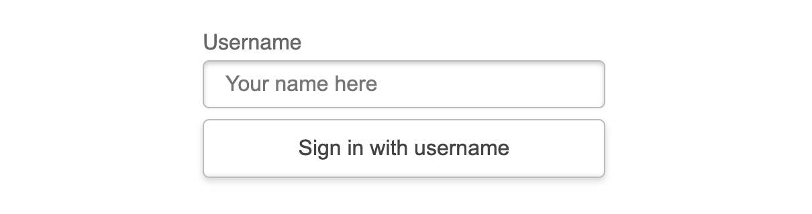

# Capture clickstream data from your ecommerce web site using a highly scalable low latency distributed database

In this code pattern, we will create a database of ecommerce clickstream data with DataStax Enterprise (DSE) or Apache Cassandra. Using Red Hat OpenShift and the DataStax Kubernetes Operator for Apache Cassandra, you can deploy this distributed database on-premise, or on your cloud provider of choice with a unified OpenShift experience. If you prefer a database-as-a-service provider, get up and running quickly with Databases for DataStax on IBM Cloud.

When you have completed this code pattern, you will understand how to:

* Select a cloud, cluster, or development platform for Apache Cassandra or DataStax Enterprise (DSE)
* Provision Databases on IBM Cloud or any cloud with OpenShift
* Design and create a database for DSE
* Use CQL and CQLSH to create and query your database
* Use the Node.js client to interact with your database


## Flow

1. Users interact with ecommerce web site
1. Web pages and components capture clicks
1. Clickstream data is stored in a fast-write highly scalable database

## About DataStax and Cassandra

**Apache Cassandra** is an open source NoSQL distributed database. Cassandra graduated to a top-level Apache project over a decade ago and has been (and consistently continues to be) an incredibly popular choice. Thousands of companies rely on Cassandra.

**DataStax** is a company that is focused on Cassandra. In addition to being one of the top contributors to open source Cassandra, DataStax also provides DataStax Enterprise (DSE) -- built on Apache Cassandra and enhanced for enterprise use cases.

Whether you choose DSE or an open source distribution of Cassandra, DataStax is there to provide support, consulting and much more. Even if you start with the open source version of Cassandra, you won't get far before you realize that DataStax is helping you. For example, in this code pattern we'll need a client driver to connect to Cassandra from Node.js. That driver is provided by DataStax. We also use the CQLSH tool to interact with the database. We download that tool from DataStax.

## NoSQL, SQL, and CQL

Cassandra is often considered a "NoSQL" database, but as you use it, you will see a language that sure looks like SQL. That's awkward. First of all, it might help to say that "NoSQL" is short for "not only SQL" (or maybe just don't use that term at all). The key thing to remember is that Cassandra was designed to excel at some things that traditional relation databases are not so good at. Along with the benefits of this specialization, Cassandra also comes with some things that you cannot or should not do.

In this code pattern, you will create a database that is distributed and highly scalable. Cassandra is optimized for low latency fast writes. Reads across partitions are more expensive. Our data model will need to consider what queries will need to be supported with denormalized tables. In some cases, queries that you might use with a traditional relational database (RDBMS) will not be allowed (or you might get a warning).

For specifics about the query language, refer to [The Cassandra Query Language (CQL)](http://cassandra.apache.org/doc/latest/cql/index.html). CQL will be familiar to SQL users, but you will want to keep the CQL documentation bookmarked while you learn the differences.

## Steps

1. Clone the repo
1. Deploy the database
1. Interact with your database using CQL and CQLSH
1. Interact with your database using the DataStax Node.js client

## Step 1. Clone the repo

```bash
git clone https://github.com/IBM/datastax-cassandra-clickstream.git
```

## Step 2. Deploy the database

Choose your platform and spin up a database:

* Get a fully managed database-as-a-service with [IBM Cloud Databases for DataStax](https://www.ibm.com/cloud/blog/announcements/ibm-cloud-databases-for-datastax).
* Avoid vendor lock-in with an OpenShift cluster running on any cloud or on-premise.


Click on one of the following links for specific instructions:

* [Deploy a database using Databases for DataStax on IBM Cloud](doc/source/dbaas.md)
* [Deploy on OpenShift with Amazon Web Services](doc/source/aws.md)

## Step 3. Interact with your database using CQL and CQLSH

Similar to all popular databases, perhaps the most common way to interact with your database is with a terminal shell and an interactive query tool. This is, at the very least, a tool you should have handy, and so it is how we'll get started.

For Cassandra, the tool is CQLSH. Here we'll demonstrate using CQLSH to interact with the database. Connect to a CQLSH shell following the post-deployment instructions in Step 2. The following CQL examples are the same for either deployment type.

Here are a few tips:

* Remember to terminate every command or query with a semi-colon (and then hit enter).

* `USE <keyspace-name>;` is a good first command. Alternatively, you can specify your keyspace name with fully qualified tables names like `<keyspace-name>.<table-name>`.

* Use `exit;` to terminate CQLSH.

### Create a keyspace

Using CQLSH, create a keyspace to use. In our examples, we use "ks1" as the keyspace name.

```shell
CREATE KEYSPACE IF NOT EXISTS ks1 
WITH replication = {
  'class' : 'SimpleStrategy',
  'replication_factor' : 1
};

USE ks1;
```

### Create tables

See DataStax documentation for [CREATE TABLE](https://docs.datastax.com/en/dse/6.8/cql/cql/cql_reference/cql_commands/cqlCreateTable.html).

#### Create a table with a simple key

When there is a one primary key column, it is also used as the partition key. You can specify `PRIMARY KEY` in the column definition.

```shell
CREATE TABLE IF NOT EXISTS product (
  product TEXT PRIMARY KEY,
  demand INT
);
```

#### Create a table with a compound key

When there are multiple columns in the key, use a separate `PRIMARY KEY (column_list)` as shown below. The additional parenthesis is used to indicate which part of the key should be used as the partition key.

```shell
CREATE TABLE IF NOT EXISTS plant_product (
  plant TEXT,
  product TEXT,
  cost DECIMAL,
  capacity INT,
  PRIMARY KEY ((plant), product)
);
```

> NOTE: In CQLSH colors indicate partition and primary key columns.


### Insert/Update (upsert) data

In CQL, both the INSERT and the UPDATE commands act like an "UPSERT" unless "IF NOT EXISTS" is used on INSERT.  That is, a row will be inserted if the key values are new, but if a row already exists with those key values, then it will be updated.

See DataStax documentation for [UPDATE](https://docs.datastax.com/en/dse/6.8/cql/cql/cql_reference/cql_commands/cqlUpdate.html)

```shell
UPDATE product
  SET demand = 300
  WHERE product = 'handSanitizer';
```

```shell
UPDATE product
  SET demand = 500
  WHERE product = 'mask';
```


### Using insert without upserting

See DataStax documentation for [INSERT](https://docs.datastax.com/en/dse/6.8/cql/cql/cql_reference/cql_commands/cqlInsert.html).

A simple example to insert a row without allowing an update of an existing row.

```shell
INSERT INTO product (
  product, demand
) values (
  'handSanitizer', 100
)
 IF NOT EXISTS;
```

Notice that in your output, the `[applied]` value of `False` indicates that the insert was not applied and the returned demand value shows the existing value.


### Using batches

See DataStax documentation for [using batch](https://docs.datastax.com/en/dse/6.8/cql/cql/cql_using/useBatch.html) and the [BATCH](https://docs.datastax.com/en/dse/6.8/cql/cql/cql_reference/cql_commands/cqlBatch.html) command.

* You can use BATCH to group commands and:
  * Reduce round trip latency
  * Treat the commands as one atomic unit
* For performance reasons, you should never have a BATCH go across partitions.

Try the following simple example.  Batches are used to update both capacity settings for a plant in a single unit.

Each plant is in a separate batch, so that the batch does not need to span partitions.

```shell
BEGIN BATCH
UPDATE plant_product
  SET cost = 500, capacity = 10
  WHERE plant = '1'
    AND product = 'mask';
UPDATE plant_product
  SET cost = 500, capacity = 10
  WHERE plant = '1'
    AND product = 'handSanitizer';
APPLY BATCH;

BEGIN BATCH
UPDATE plant_product
  SET cost = 500, capacity = 20
  WHERE plant = '2'
    AND product = 'mask';
UPDATE plant_product
  SET cost = 500, capacity = 20
  WHERE plant = '2'
    AND product = 'handSanitizer';
APPLY BATCH;
    
BEGIN BATCH
UPDATE plant_product
  SET cost = 500, capacity = 30
  WHERE plant = '3'
    AND product = 'mask';
UPDATE plant_product
  SET cost = 500, capacity = 30
  WHERE plant = '3'
    AND product = 'handSanitizer';
APPLY BATCH;

BEGIN BATCH
UPDATE plant_product
  SET cost = 500, capacity = 40
  WHERE plant = '4'
    AND product = 'mask';
UPDATE plant_product
  SET cost = 500, capacity = 40
  WHERE plant = '4'
    AND product = 'handSanitizer';
APPLY BATCH;
```

## Setup for the clickstream data

### Create the table in your namespace

```shell
CREATE TABLE IF NOT EXISTS clickstream (
  customer_id INT,
  time_stamp TIMESTAMP,
  click_event_type TEXT,
  product_name TEXT,
  product_category TEXT,
  product_price DECIMAL,
  total_price_of_basket DECIMAL,
  total_number_of_items_in_basket INT,
  total_number_of_distinct_items_in_basket INT,
  session_duration INT,
  PRIMARY KEY ((customer_id, click_event_type), time_stamp)
);
```

## Step 4. Interact with your database using the DataStax Node.js client


### Using the DataStax Node.js client

If you'd like to see the source code for interacting with the DataStax Node.js client, look in [services/clicks.service.js](services/clicks.service.js). Here we have:

* A Client connection created based on the environment configuration
* execCQL() to wrap our calls to the DataStax client.execute()
* addToCart() to issue the parameterized CQL for the add to cart clicks
* trackPageBrowsing() to issue the parameterized CQL for page browsing clicks

#### Configure your .env file

* Copy **env.sample** to **.env**
* Edit **.env** to set your:
  * secure bundle zip path
  * username
  * password
  * keyspace name

```bash
# DataStax connection parameters
DSE_SECURE_CONNECT_BUNDLE=/Users/<your-user>/Downloads/e5f60a65-3e97-40e7-9aef-14807b4be719-public.zip
DSE_USERNAME=<your-username>
DSE_PASSWORD=<your-password>
DSE_KEYSPACE=<your-keyspace-name>
```

#### Start the Next.js web app in dev mode

Run the following commands to install dependencies and run the web app in dev mode.

```bash
npm install
npm run dev
```

> NOTE: For production you would build with `npm run build` and then `npm start` (instead of `npm dev`).

#### Browse and click

To use your local Bee-Commerce Essentials web app, browse to http://localhost:8080

#### Sign in

In order to get a **Customer ID**, the web app has a simple (fake) authentication implementation.

* Click on the `Sign in` icon or link.
  
* Enter any user ID
* Ignore the password field
* Click the `Sign in with Credentials` button
  
* Notice the customer ID (it is simply a few character codes from your user name).
  

> Note: When you are not signed in, we'll just use Customer ID 0 and still allow all the functionality.

#### Browse and watch the logged output

You can browse by clicking on the icons for storefront, the all products page (magnifier glass), and your cart. From the storefront, you can also browse a category. As you browse, watch your application output (or log) to see the clicks that are being logged. This is handled by the server-side rendering and the clickstream is fed into your DSE database (if properly configured).


#### Add products to your cart

From a category page or the all products page, you can click on an `Add to cart` button. This will result in an add-to-cart click being logged and fed into your DSE table. The `Add to cart` is a client-side component. It uses a client-side React component which fetches a server-side API to interact with the database.


<!-- TODO:
#### Notice the data in logs and the table

* TODO: Need a clean database query example
* TODO: Improve the logging example after cleaned up
-->

## Links

* [A Brief Overview of the Database Landscape](https://www.ibm.com/cloud/blog/brief-overview-database-landscape)
* [About cloud databases](https://www.ibm.com/cloud/learn/cloud-database?mhsrc=ibmsearch_a&mhq=databases)
* [IBM Cloud Databases: SQL and NoSQL](https://www.ibm.com/cloud/blog/sql-vs-nosql)
* [How to choose a database on IBM Cloud](https://www.ibm.com/cloud/blog/how-to-choose-a-database-on-ibm-cloud)

## License

This code pattern is licensed under the Apache License, Version 2. Separate third-party code objects invoked within this code pattern are licensed by their respective providers pursuant to their own separate licenses. Contributions are subject to the [Developer Certificate of Origin, Version 1.1](https://developercertificate.org/) and the [Apache License, Version 2](https://www.apache.org/licenses/LICENSE-2.0.txt).

[Apache License FAQ](https://www.apache.org/foundation/license-faq.html#WhatDoesItMEAN)
