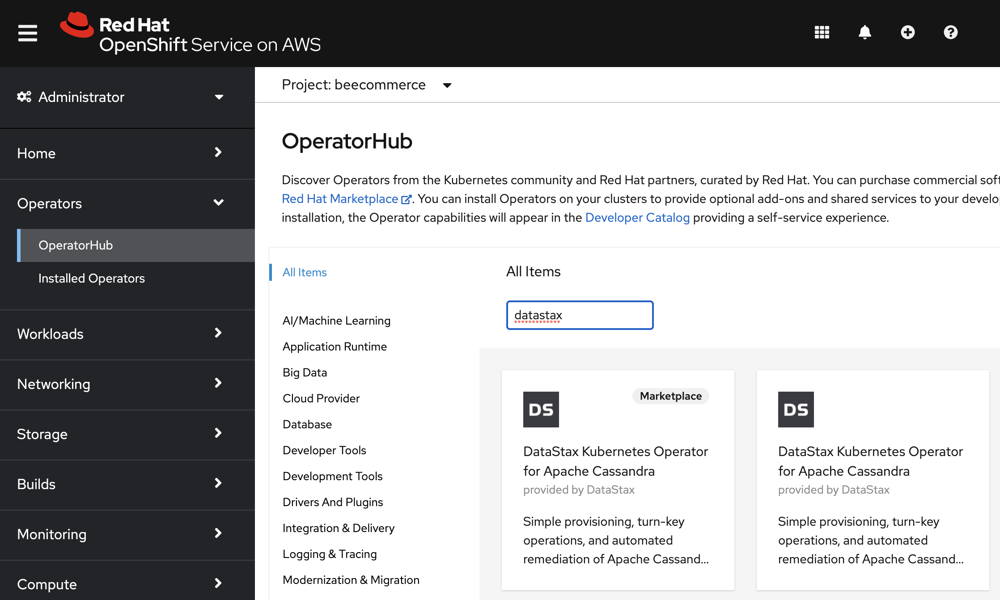
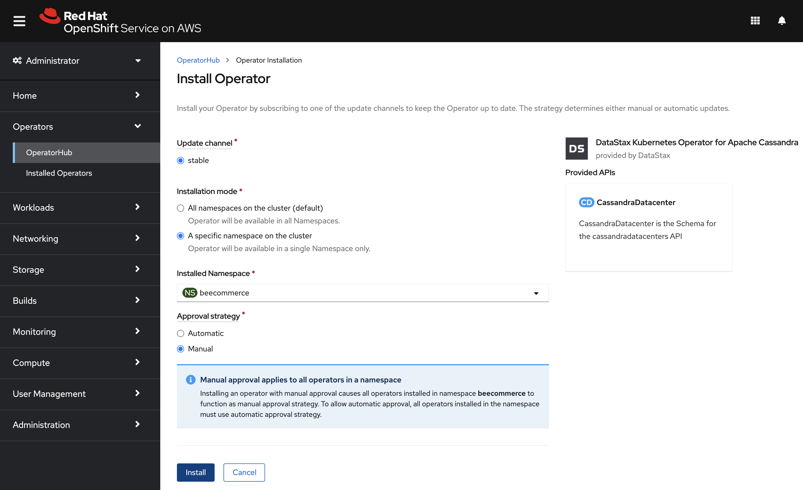
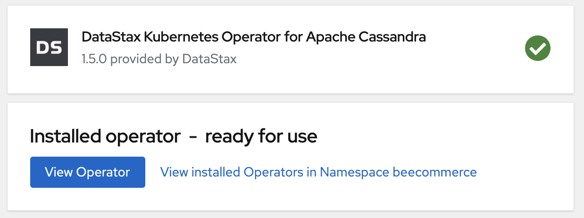
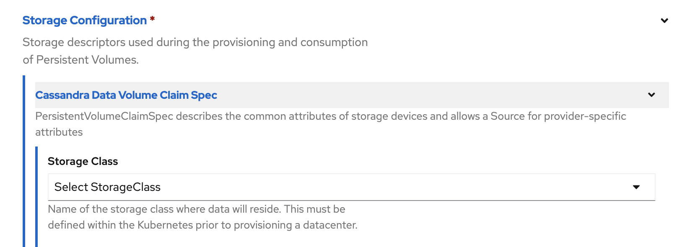

# Deploy on OpenShift with Amazon Web Services

## Hybrid cloud with OpenShift

Using Red Hat OpenShift and the DataStax Kubernetes Operator for Apache Cassandra, you can deploy this distributed database on-premise, or on your cloud provider of choice with a unified OpenShift experience.

For example, here we will guide you to setup this code pattern to run with Red Hat OpenShift on Amazon Web Services (AWS).

## Prerequisites

* [RedHat OpenShift Service installed on AWS](https://docs.openshift.com/container-platform/4.8/installing/installing_aws/preparing-to-install-on-aws.html)
* An OpenShift user with admin access
* Local [install of `oc` command-line tool](https://docs.openshift.com/container-platform/4.8/installing/installing_aws/installing-aws-default.html#cli-installing-cli_installing-aws-default)

## Login to the console and command-line tool

* Use your service URL and user login to access the OpenShift Console.
* Click on your name in the upper-right corner and select **Copy login command** and copy the command under **Log in with this token**.
* Use the provided login command to login to OpenShift in a terminal.

```bash
oc login --token=sha256~xxXxXXXxXXxX9xxx9XX9xxxx9XXXxX-XxXxXXXXxXxx --server=https://api.your_url.openshiftapps.com:6443
```

## Create a project / namespace

Create your project using the `oc` command line. In our examples we'll use **beecommerce** as the project name.

```bash
oc new-project beecommerce
```

## Webhook setup

<!-- Maintainer note: The operator describes these prereqs and file contents. We could remove this and just say follow the instructions before you hit the `Install` button. Especially if these change over time! -->

Edit/review the config YAML in the `config` directory of your cloned repo. If you used a different project name, replace `beecommerce` with your project/namespace in the two files that require it.

* webhook_service.yaml
* webhook_configuration.yaml
* webhook_service.yaml

Run the setup using `oc create` and your YAML files:

```bash
cd config
oc create -f webhook_secret.yaml
oc create -f webhook_configuration.yaml
oc create -f webhook_service.yaml      
```

## Install the Operator

* Select the `Administrator` perspective
* Expand `Operators` in the sidebar
* Select `OperatorHub`
* Search for `datastax`
* Click on the `DataStax Kubernetes Operator for Apache Cassandra` card
  
* Review the prerequisites. You should have done them in the previous section (Webhook setup).
* Click on the `Install` button!
* Select the `A specific namespace on the cluster` radio button.
* Select your namespace under `Installed Namespace`.
* Select the `Manual` radio button under `Approval strategy`.
* Install with manual approval:
  
* Click on the `Install` button!
* Click on the `Approve` button.
* Wait for the **"ready for use"** message.
   
* Click on the `View Operator` button.
* Select the `CassandraDatacenter` tab.
* Refresh the page.
* Hit the `Create CassandraDatacenter` button.
  
* Expand `Storage Configuration > Cassandra Data Volume Claim Spec >  Storage Class > Select Storage Class` and choose your storage class.  <!-- Maintainers note: using gp2 -->
  
* Hit the `Create` button at the bottom.

### Check the pod status

Use `oc get pods` to monitor the pod status. Watch for **cluster1-dc1-default-sts-0** to have **2/2** pods **READY** with a status of **Running**.

```bash
$ oc get pods
NAME                             READY   STATUS    RESTARTS   AGE
cass-operator-6969d4d588-zswc4   1/1     Running   0          9m51s
$ oc get pods
NAME                             READY   STATUS     RESTARTS   AGE
cass-operator-6969d4d588-zswc4   1/1     Running    0          25m
cluster1-dc1-default-sts-0       0/2     Init:0/1   0          33s
$ oc get pods
NAME                             READY   STATUS    RESTARTS   AGE
cass-operator-6969d4d588-zswc4   1/1     Running   0          26m
cluster1-dc1-default-sts-0       1/2     Running   0          60s
$ oc get pods
NAME                             READY   STATUS    RESTARTS   AGE
cass-operator-6969d4d588-zswc4   1/1     Running   0          28m
cluster1-dc1-default-sts-0       2/2     Running   0          2m59s
```

### Use nodetool to check status

You can use `oc rsh` to run the `nodetool status` command on the pod to get more information about the deployment.

```shell
$ oc rsh cluster1-dc1-default-sts-0 nodetool status
Defaulting container name to cassandra.
Use 'oc describe pod/cluster1-dc1-default-sts-0 -n beecommerce' to see all of the containers in this pod.
Datacenter: dc1
===============
Status=Up/Down
|/ State=Normal/Leaving/Joining/Moving
--  Address       Load       Owns (effective)  Host ID                               Token                                    Rack
UN  10.129.2.136  65.3 KiB   100.0%            488c7e8d-33b5-47f6-8164-08b03fb2b324  5947076073932733896                      default
```

## Connect with CQLSH

Installing the database using the operator does not include setting up ingress to connect directly to the database from outside the cluster. It is often a best practice to keep it this way. The database can be accessed by an application running inside the cluster without additional exposure. To interact with the database via CQLSH, we can use `oc rsh` to remote shell into the container and run the `cqlsh` command which was already installed by the operator.

### Get the username and password from the secret

The secret named **cluster1-superuser** contains a username and password that you can use to connect to your database. You will probably want to create additional users and passwords, but we'll use the one provided. You can copy the username and password from the secret using the OpenShift console, or you can obtain them using the `oc` commands shown below.

```bash
# Get the CQL username
oc get secret cluster1-superuser -o yaml | grep " username" | awk -F" " '{print $2}' | base64 -d && echo ""

# Get the CQL password
oc get secret cluster1-superuser -o yaml | grep " password" | awk -F" " '{print $2}' | base64 -d && echo ""

```

### Interact with the database using CQLSH

Use `oc rsh` to run the `cqlsh` command on the pod to interact with the database.

```sh
# Run CQLSH using the username and password obtained above
oc rsh cluster1-dc1-default-sts-0 cqlsh -u <cql-username> -p <cql-password>
```

Example with output (and exit):

```shell
$ oc rsh cluster1-dc1-default-sts-0 cqlsh -u cluster1-superuser -p 1OfZ2eNotreal6aa4PASSWDfan4USED9zzxHEREzztOCE9Ab3Um9fw 
Defaulting container name to cassandra.
Use 'oc describe pod/cluster1-dc1-default-sts-0 -n beecommerce' to see all of the containers in this pod.

Warning: Cannot create directory at `/.cassandra`. Command history will not be saved.

Connected to cluster1 at 127.0.0.1:9042.
[cqlsh 5.0.1 | Cassandra 3.11.7 | CQL spec 3.4.4 | Native protocol v4]
Use HELP for help.
cluster1-superuser@cqlsh>
cluster1-superuser@cqlsh> exit
$ 
```

Go back to the README.md and follow the instructions to interact with the database using CQLSH.

[](../../README.md#4-use-the-web-app)
