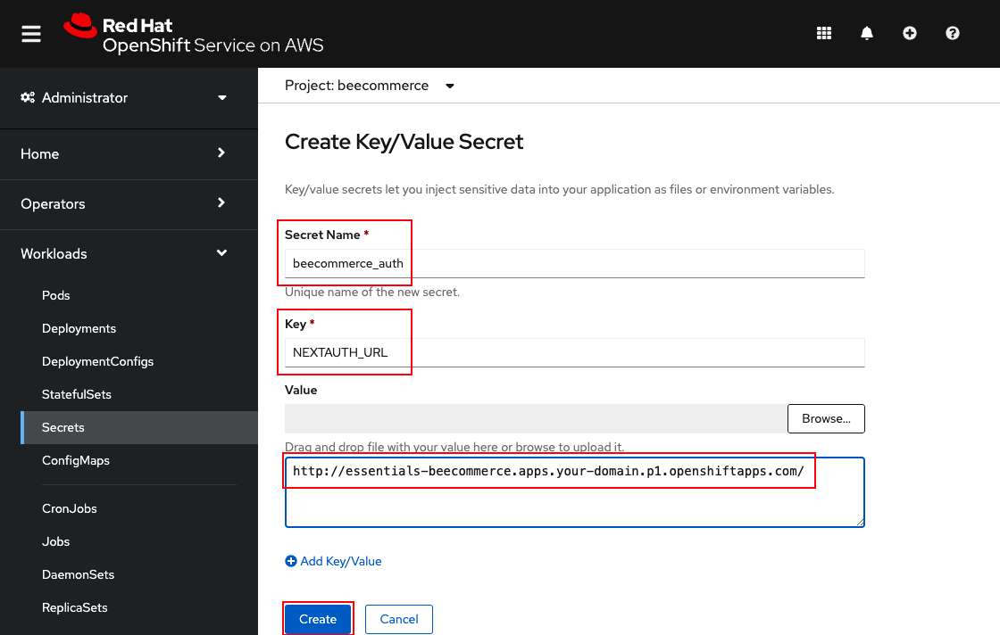

# Deploy the web app on OpenShift

## Hybrid cloud with OpenShift

Using Red Hat OpenShift and the DataStax Kubernetes Operator for Apache Cassandra, you have deployed this distributed database on-premise or on your cloud provider of choice with a unified OpenShift experience.

Next you will deploy the web app in the same OpenShift project as your database, and you will configure the application to connect to the database. In our example, we never exposed the database service outside the cluster.

## Login to the console and command-line tool

* Use your service URL and user login to access the OpenShift Console.
* Click on your name in the upper-right corner and select **Copy login command** and copy the command under **Log in with this token**.
* Use the provided login command to login to OpenShift in a terminal.

```bash
oc login --token=sha256~xxXxXXXxXXxX9xxx9XX9xxxx9XXXxX-XxXxXXXXxXxx --server=https://api.your_url.openshiftapps.com:6443
```

## Switch to your project / namespace

Use the `oc` command line to switch to (or confirm) that you are in the project where you created your database. In our examples, we use **beecommerce** as the project name.

```bash
oc project beecommerce
```

## Create a new app

Create the app directly from the GitHub repo using `oc new-app` (and optionally provide a name). In our example, we use *essentials* as the application name. After you create the new app, use `oc expose` to make the app (the *essentials* service) available for public use.

```bash
oc new-app https://github.com/IBM/datastax-cassandra-clickstream.git --name essentials
oc expose svc/essentials
```

Use `oc get route` to get the host name for your exposed service:

```
$ oc get route/essentials
NAME         HOST/PORT                                                          PATH   SERVICES     PORT       TERMINATION   WILDCARD
essentials   essentials-beecommerce.apps.deg-rosa-1.a8sz.p1.openshiftapps.com          essentials   8080-tcp                 None
```

## Configure the app

### Provide the username and password from the secret

By default, the secret named **cluster1-superuser** contains a username and password that you can use to connect to your database. If you create an additional user, you can create a secret to provide the user/password environment variables as described below (for NEXTAUTH_URL). Here we use the superuser provided. Add the secret to your workload using the OpenShift console.

* Select the `Administrator` perspective
* Expand `Workloads` in the sidebar
* Select `Secrets`
* Click on `cluster1-superuser`
* Hit the `Add Secret to workload` button
* Use the `Select a workload` pulldown to select your application (e.g. *essentials* in our example).
* Hit the `Save` button
* The application will restart with an environment that includes the username/password that it needs to connect to the database.


### Provide additional environment variables with a secret

Our application uses NextAuth to handle the sign-in/sign-out which gives us the customer ID that we want in our clickstream data. NextAuth uses a default callback of localhost:3000, but our web app is running on OpenShift so our client code will need to know our exposed route to access our auth pages.

You can create a secret or a config map and assign it to your workload using the OpenShift console. We'll use a keyword/value secret. This provides the environment variable that we need for NEXTAUTH_URL.

* Select the `Administrator` perspective
* Expand `Workloads` in the sidebar
* Select `Secrets`
* Hit the `Create` button
* Select `Key/value secret`
* Give the secret a `Name`
* Set the first `Key` to `NEXTAUTH_URL`
* In the text box under `Value` enter the host of your exposed service adding a prefix of `http://`. This is the URL you would use if you open your app in a browser.
* *Optionally*, click on  `Add Key/Value` if you want to set a DSE_KEYSPACE (other than our default of *ks1*) or a DSE_USERNAME and DSE_PASSWORD to use instead of the superuser secret used above.
* Hit the `Add Secret to workload` button
* Use the `Select a workload` pulldown to select your application (e.g. *essentials* in our example).
* Hit the `Save` button
* The application will restart with an environment that includes the environment variables that you set using a key/value secret.



## Interact with the application

Go back to the README.md and follow the instructions to interact with the application to create clickstream data in your database.

[](../../README.md#use-the-web-app)
