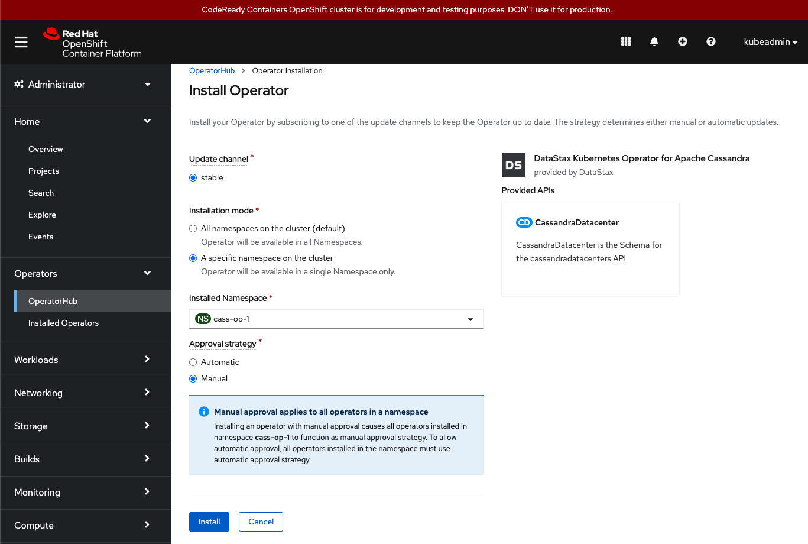
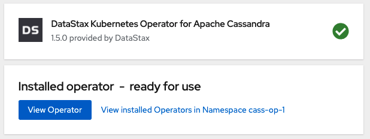
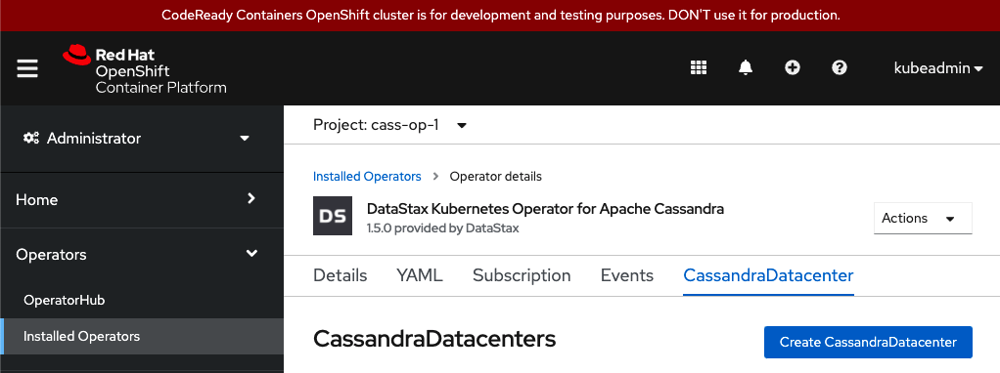
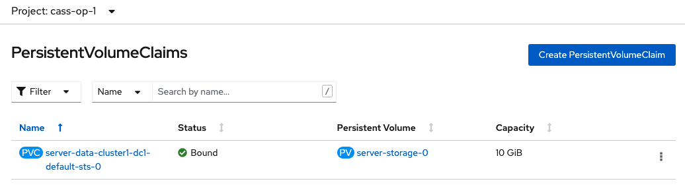

# Install on OpenShift

## Create a project / namespace

Create your project using the `oc` command line.

```bash
oc new-project <project-name>
```

## Configure webhooks

Edit the config YAML in the `config` directory of your cloned repo:

* webhook_service.yaml
* webhook_configuration.yaml
* webhook_service.yaml

Run the setup using `oc create` and your YAML files:

```bash
cd config
oc create -f webhook_secret.yaml
oc create -f webhook_configuration.yaml
oc create -f webhook_service.yaml      
```

## Install the Operator

* Install with manual approval:

  

* Ready for use:

   

* Create datacenter

  * Refresh the page, if needed
  * Hit the `Create CassandraDatacenter` button

  

## Allocate storage

### Determine your master node `NAME`

```bash
$ oc get nodes
NAME                 STATUS   ROLES           AGE   VERSION
crc-pkjt4-master-0   Ready    master,worker   8d    v1.20.0+df9c838
```

### Create persistent volumes

1. Edit the yaml in config/storage.yaml to specify your master node from above
1. Use `oc create` to create persistent volumes:

```bash
cd config
vi storage.yaml)
oc create -f storage.yaml
```

## Check the status

### Check for bound persistent volume claims



### Check for pod status

```bash
$ oc get pods
NAME                            READY   STATUS            RESTARTS   AGE
cass-operator-dcdfcc8cc-2qcjp   1/1     Running           0          47m
cluster1-dc1-default-sts-0      0/2     PodInitializing   0          31m

$ oc get pods
NAME                            READY   STATUS    RESTARTS   AGE
cass-operator-dcdfcc8cc-2qcjp   1/1     Running   0          49m
cluster1-dc1-default-sts-0      1/2     Running   0          33m
```

### Use nodetool to check status

```bash
$ oc rsh cluster1-dc1-default-sts-0 nodetool status
Defaulting container name to cassandra.
Use 'oc describe pod/cluster1-dc1-default-sts-0 -n cass-op-1' to see all of the containers in this pod.
Datacenter: dc1
===============
Status=Up/Down
|/ State=Normal/Leaving/Joining/Moving
--  Address      Load       Owns (effective)  Host ID                               Token                                    Rack
UN  10.217.0.51  65.31 KiB  100.0%            a406bd97-233d-44c2-8d5a-6c34f9ff0b88  -4442108182540320158                     default
```

## Connect with CQLSH

### Get your user/pass and connect with CQLSH

```bash
# Get the CQL username
kubectl -n cass-operator get secret cluster1-superuser -o yaml | grep " username" | awk -F" " '{print $2}' | base64 -d && echo ""

# Get the CQL password
kubectl -n cass-operator get secret cluster1-superuser -o yaml | grep " password" | awk -F" " '{print $2}' | base64 -d && echo ""

# Run CQLSH
kubectl -n cass-operator exec -it cluster1-dc1-default-sts-0 -- cqlsh -u <cql-username> -p <cql-password>

Connected to cluster1 at 127.0.0.1:9042.
[cqlsh 5.0.1 | Cassandra 3.11.7 | CQL spec 3.4.4 | Native protocol v4]
Use HELP for help.
cluster1-superuser@cqlsh>
```
