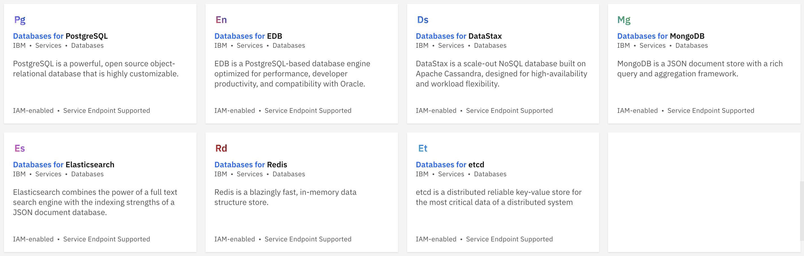
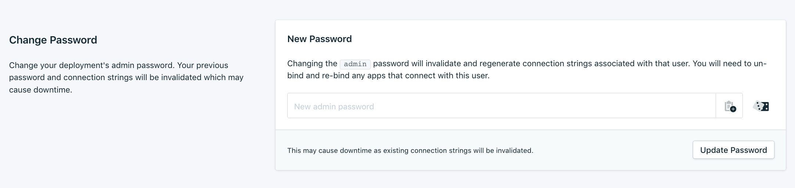
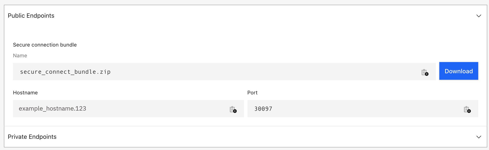

# Deploy a database using Databases for DataStax on IBM Cloud

DataStax is a scale-out NoSQL database built on Apache Cassandra, designed for high-availability and workload flexibility. Databases for DataStax makes DataStax even better by managing it for you.

1. Find **Databases for DataStax** in the catalog [here](https://cloud.ibm.com/catalog/services/databases-for-cassandra)
1. Select your options as described on the page
1. Click the `Create` button
   
1. Before connecting to your DataStax service, you must set your admin password as described [here](https://cloud.ibm.com/docs/databases-for-cassandra?topic=databases-for-cassandra-admin-password).
   
1. Download the credentials from your provisioned service on IBM Cloud. They come in a zip file and include information about the hostname and certificates you can use for SSL based auth. This will be referred to as your **secure connection bundle**.
   

## Setup CQLSH

### Running CQLSH locally

You can securely connect to a database with a public endpoint using CQLSH and a "secure connect bundle". This is typically how you would interact with a DBaaS, so we'll use Databases for DataStax on IBM Cloud as our example for running CQLSH locally and establishing a secure connection to remote database.

#### Download CQLSH


* Browse to [https://downloads.datastax.com/#cqlsh](https://downloads.datastax.com/#cqlsh)
* Select the your version
* Click the box if you agree to the terms
* Hit the **Download** button
* Extract the zip file:
  * On some platforms, double-click on the `.gz` file to unzip it
  * Otherwise use the tar command: `tar -xvf cqlsh-<version>-bin.tar.gz`
* The `cqlsh` executable is under the `bin` subdirectory

#### Connect using CSQLSH

Provide your user, password and path to the secure connection bundle to the CQLSH command:

```shell
./bin/cqlsh -u admin -p <password> -b /<path_to_secure-connect-bundle.zip>
```

#### Example with output (and exit)

```shell
$ ./bin/cqlsh -u admin -p <admin-password> -b /<path>/e5z99a65-3a99-40e7-9aef-12345b4zz999-public.zip
Connected to datastax_enterprise at 127.0.0.1:9042.
[cqlsh 6.8.0 | DSE 6.8.7 | CQL spec 3.4.5 | DSE protocol v2]
Use HELP for help.
admin@cqlsh>
admin@cqlsh> exit
```

## Interact with the database

Go back to the README.md and follow the instructions to interact with the database using CQLSH.

[](../../README.md#4-use-the-web-app)

