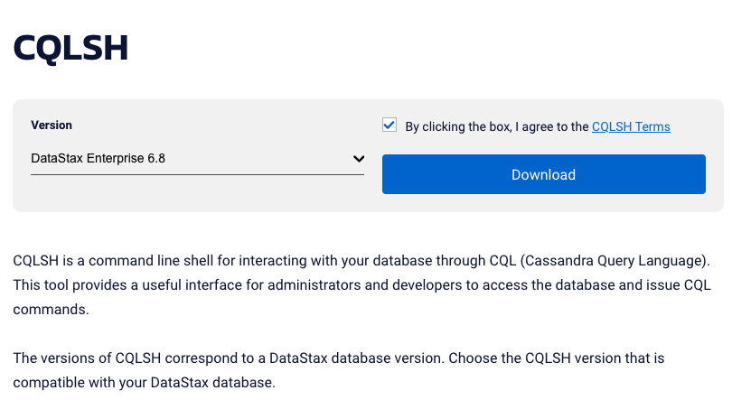

# Using a Databases for DataStax on IBM Cloud

Databases for DataStax is an Apache Cassandra based database that is available through IBM Cloud. See the [catalog]() and [docs]() for more details. Below is a write up that explains how to provision an instance of the database and how to use the CQLSH command line tool.

1. Provision DataStax on IBM Cloud
1. Setup CQLSH
1. Interact with the database

## Provision DataStax on IBM Cloud

1. Find the service in the [catalog]()

   

1. Once provisioned, you must [set an admin password]()!

   

1. Download the credentials, they come in a zip file and include information about the hostname and certificates you can use for SSL based auth.

   

## Setup CQLSH

Download CQLSH from DataStax [here](https://downloads.datastax.com/#cqlsh).
* Select the version that corresponds to the version of the server you created (e.g., DataStax Enterprise 6.8).
* Click the checkbox to agree to the terms.
* Click `Download`.

   

* The download is a file like cqlsh-6.8.5-bin.tar.gz, unzip it and use it as a stand-alone CLI.

  ```shell
  gzip -d cqlsh-6.8.5-bin.tar.gz
  tar -xvf cqlsh-6.8.5-bin.tar
  cd cqlsh-6.8.5
  ```

* Authenticate by pointing to the credentials (with a -b flag) that you downloaded, and passing in the username/password combination.

  ```shell
  cqlsh-6.8.5 ./bin/cqlsh -u admin -p datastax-dev -b ~/Downloads/830e4aa3-9b95-49f0-a43c-be76c509b610-public.zip
  Connected to datastax_enterprise at 127.0.0.1:9042.
  [cqlsh 6.8.0 | DSE 6.8.7 | CQL spec 3.4.5 | DSE protocol v2]
  Use HELP for help.
  admin@cqlsh>
  ```

## Interact with the database

Now you can interact with the database!

Here are a few tips:

* Remember to terminate every command or query with a semi-colon (and then hit enter).

* `USE <keyspace-name>;` is a good first command. Alternatively, you can specify your keyspace name with fully qualified tables names like `<keyspace-name>.<table-name>`.

* Use `exit;` to terminte CQLSH.

* Go back to the main [README.md](../../README.md) for detailed steps using CQLSH to:
  * Create a keyspace
  * Create a table in the keyspace
  * Copy data into the table
  * Query the table
