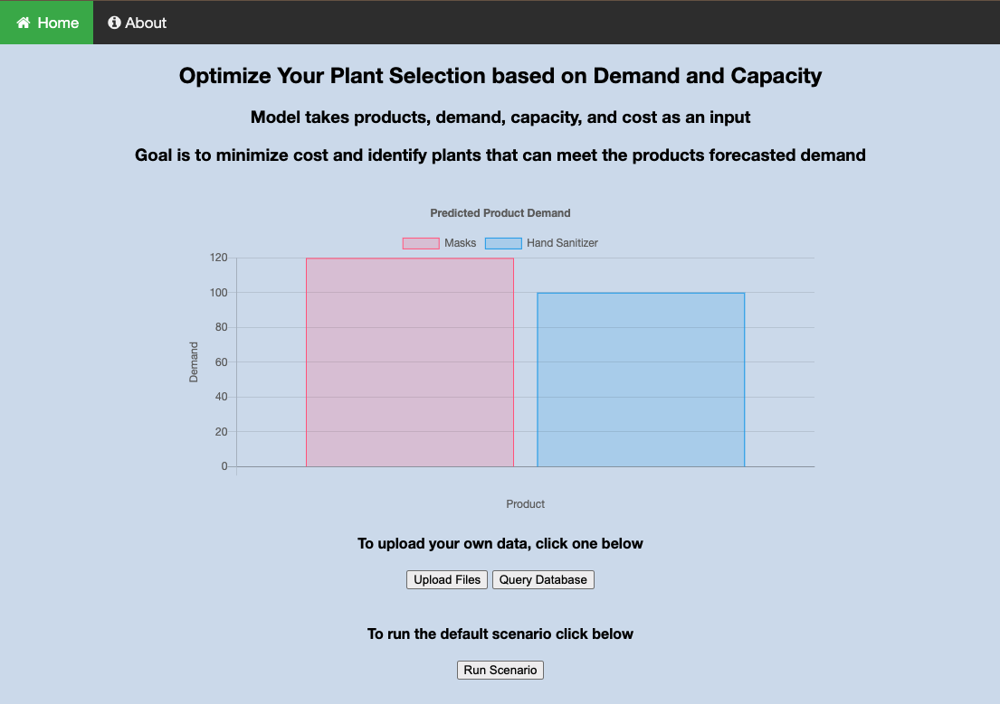
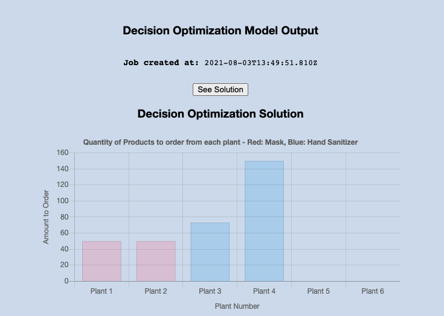
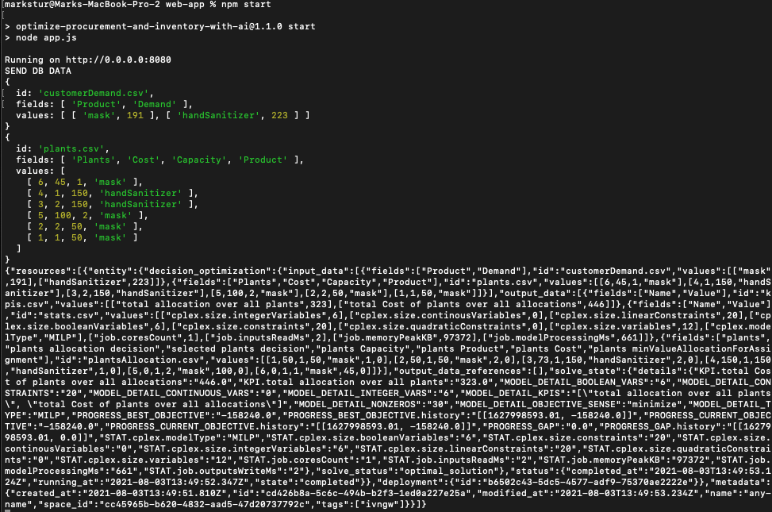

# Integration with Decision Optimization App

## Query Database

Instead of `Upload Files`, the app can directly query a DSE or Cassandra database.

## See Solution

The "Decision Optimization Solution" shows how to optimally procure masks and hand sanitizer based on plant capacity and cost (now using data from the database).

## Logging shows data sent from database to the decision optimization model

